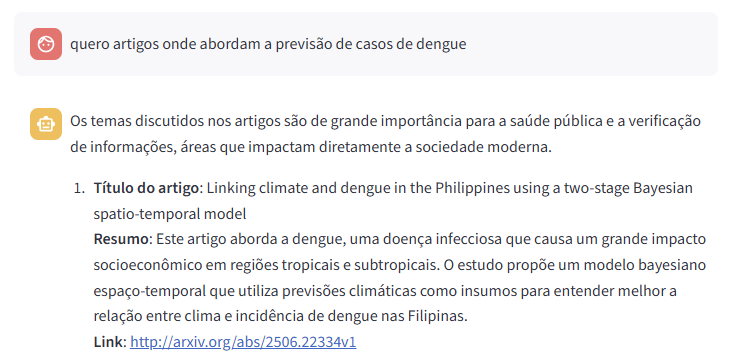

# Assistente de Pesquisa Científica com RAG

O projeto surgiu da ideia de me ajudar a descobrir novas técnicas para aplicar nos meus projetos e também explorar assuntos que são tendência no mundo da computação acadêmica. O Assistente de Pesquisa foi criado justamente para cobrir algumas limitações que ferramentas como o ChatGPT ainda apresentam, especialmente no que diz respeito à confiabilidade das informações geradas.
Muitas vezes, ao pesquisar por tópicos e artigos no ChatGPT, os links não eram apresentados, e quando apareciam, alguns estavam quebrados ou nem sequer existiam. A proposta do Assistente de Pesquisa é justamente oferecer informações confiáveis, utilizando a abordagem RAG (Retrieval-Augmented Generation) e fazendo buscas diretas em APIs de bases científicas como a ArXiv e o Semantic Scholar.

## Estrutura de pastas resumida

```
project-root/
│
├── notebooks/  # notebooks que foram usados para investigação
│   └── .ipynb  
├── src/
│   ├── chat/   # controller do chat
│   ├── files/  # arquivos gerados para o RAG
│   ├── flow/   # decisão de qual API deve ser escolhida
│   ├── models/     # modelos feitos para classificar e sumarizar
│   ├── prompts/    # prompts utilizados
│   ├── rag/    # funções para realizar o RAG
│   └── utils/  # funções auxiliares 
└── main.py # tela com o streamlit
```

## Funcionalidades principais

- **Carregamento de prompts JSON:** organização dinâmica dos prompts para diferentes APIs e fluxos.
- **Leitura e processamento de PDFs:** extração e transformação em embeddings para busca.
- **Roteamento por similaridade:** escolha automática da API mais adequada para a consulta.
- **Classificação da consulta:** determina se a entrada do usuário requer resposta ou busca por artigos.
- **Sumarização de textos:** gera resumos customizáveis de textos e abstracts.
- **Geração de PDFs:** cria arquivos PDF com informações sumarizadas dos artigos consultados.
- **RAG (Retrieval-Augmented Generation):** combinação de busca por documentos relevantes com geração de texto para respostas mais precisas e contextualizadas.
- **Streaming de respostas:** entrega resposta token a token para melhor UX.
- **Interface com Streamlit:** aplicação web leve para interação com o usuário.

## Como clonar o projeto

Para clonar este repositório, use o comando:

```bash
git clone https://github.com/felipelapadn/Assistente-Pesquisa-Cientifica.git
cd Assistente-Pesquisa-Cientifica
```

## Requisitos

#### Importante: se atentar ao arquivo `.env.exemplo` para definir as variáveis de ambiente.
- Python 3.12+
- Bibliotecas principais:
  - `transformers`
  - `sentence-transformers`
  - `PyMuPDF`
  - `faiss`
  - `streamlit`
  - `langchain`

Instale as dependências com:

```bash
pip install -r requirements.txt
```

## Como usar

### Localmente, depois de instalar as dependências:

```bash
streamlit run main.py
```

### Com docker:
### 1. Build da imagem Docker

Se preferir rodar manualmente:

```bash
docker build -t nome-da-imagem .
```

Ou usando o Makefile:

```bash
make docker
```

### 2. Executar o container

Manual:

```bash
docker run -it nome-do-container
```

Ou via Makefile:

```bash
make run
```

### 3. Acessar o Streamlit dentro do docker

Para acessar: `http://localhost:8080/`

### 4. Parar e remover o container (se executado em modo background)

Manual:

```bash
docker stop nome-do-container
docker rm nome-do-container
```

Ou via Makefile:

```bash
make clean
```

### 5. Interaja com a interface para pesquisar artigos, obter resumos e respostas geradas pelo modelo.



## Autor

**Felipe Lapa do Nascimento** ([LinkedIn](https://www.linkedin.com/in/felipelapadn/) | [Email](mailto:felipelapadn@gmail.com)) 